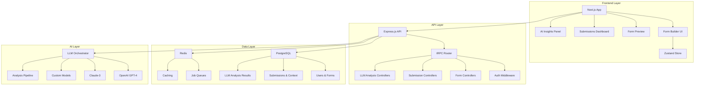
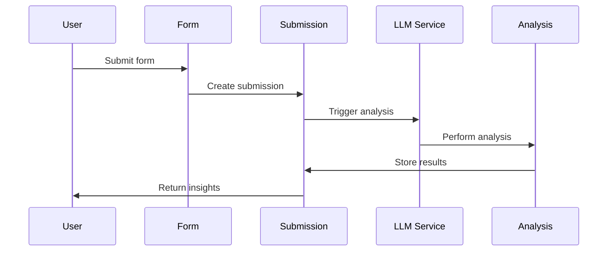

# System Architecture

---
created_date: 2025-07-28
last_modified_date: 2025-08-13
last_modified_summary: "Consolidate to Next.js API, AI FormSchema pipeline, and data integrity layers."
---

## Overview

Formular follows a modern, modular architecture designed for scalability, maintainability, and AI integration. The system is now consolidated to a single Next.js app (UI + API) with Prisma and versioned FormSchemas. AI generates typed schemas that are validated and normalized before persistence. Submissions always reference the schemaVersion used.

## High-Level Architecture



## Architecture Principles

### 1. **Universal Design**
- Core form building logic is separate from domain-specific features
- Configurable branding system for different industries
- Schema-driven field definitions for flexibility

### 2. **AI-First Architecture**
- All form data stored with metadata for LLM consumption
- Structured field definitions enable automated analysis
- Context integration for intelligent insights

### 3. **Modular Components**
- Reusable UI components with clear interfaces
- Separation of concerns between presentation and business logic
- Plugin-ready architecture for future extensions

### 4. **Performance-Optimized**
- Next.js with App Router for optimal loading
- Client-side state management with Zustand
- Lazy loading and code splitting
- Redis caching for frequently accessed data

## Technology Stack

### Frontend Stack

| Technology | Version | Purpose | Status |
|------------|---------|---------|--------|
| **Next.js** | 15.3.5 | React framework with App Router | ✅ Active |
| **React** | 19.0.0 | UI library | ✅ Active |
| **TypeScript** | 5.x | Type safety | ✅ Active |
| **Tailwind CSS** | 4.x | Styling framework | ✅ Active |
| **Zustand** | 4.5.7 | State management | ✅ Active |
| **@dnd-kit** | 6.3.1 | Drag and drop | ✅ Active |
| **React Hook Form** | - | Form handling | 🔄 Planned |
| **Zod** | - | Schema validation | 🔄 Planned |
| **Framer Motion** | - | Animations | 🔄 Planned |

### Backend Stack

| Technology | Version | Purpose | Status |
|------------|---------|---------|--------|
| **Node.js** | 18+ | Runtime environment | ✅ Active |
| **Express.js** | 5.1.0 | Web framework | ✅ Active |
| **tRPC** | 11.4.3 | Type-safe API layer | 🔄 In Progress |
| **Prisma** | 6.12.0 | Database ORM | 🔄 In Progress |
| **PostgreSQL** | 14+ | Primary database | ✅ Active |
| **Redis** | 7+ | Caching and job queues | 🔄 Planned |
| **JWT** | 9.0.2 | Authentication | ✅ Active |
| **bcryptjs** | 3.0.2 | Password hashing | ✅ Active |

### AI/LLM Stack

| Technology | Purpose | Status |
|------------|---------|--------|
| **OpenAI GPT-4** | Primary LLM for analysis | �� In Progress |
| **Claude-3** | Alternative LLM provider | 🔄 Planned |
| **Custom Models** | Proprietary model support | 🔄 Planned |
| **LLM Orchestrator** | Multi-provider management | 🔄 Planned |

### Development Stack

| Technology | Purpose | Status |
|------------|---------|--------|
| **ESLint** | Code linting | ✅ Active |
| **Prettier** | Code formatting | 🔄 Planned |
| **Jest** | Testing framework | 🔄 Planned |
| **Docker** | Containerization | 🔄 In Progress |
| **GitHub Actions** | CI/CD | 🔄 Planned |

## Data Architecture

### Core Entities

```sql
-- User Management
Users (id, email, password_hash, role, organization_id, created_at, updated_at)
Organizations (id, name, slug, settings, created_at, updated_at)

-- Form System
Forms (id, user_id, title, description, schema, settings, status, created_at, updated_at)
FormVersions (id, form_id, version, schema, changelog, created_at)
ShareSettings (id, form_id, access_type, require_auth, allow_anonymous)
SharedLinks (id, form_id, slug, access_type, expires_at, max_submissions)

-- Data Collection
Submissions (id, form_id, submitter_id, data, metadata, status, submitted_at)
LLMAnalysis (id, submission_id, form_id, analysis_type, result, confidence, model)

-- Collaboration
FormCollaborators (id, form_id, user_id, role, permissions)
BackgroundJobs (id, type, status, data, result, scheduled_at)
```

### Form Schema Structure

```typescript
interface FormSchema {
  isMultiStep: boolean;
  steps: FormStep[];
  settings: {
    enableLLMAnalysis: boolean;
    llmAnalysisTypes: AnalysisType[];
    customAnalysisPrompt?: string;
    contextFields?: ContextField[];
  };
}

interface FormStep {
  id: string;
  title: string;
  fields: FormField[];
}

interface FormField {
  id: string;
  type: 'text' | 'textarea' | 'number' | 'date' | 'select' | 'checkbox' | 'radio';
  label: string;
  placeholder?: string;
  required: boolean;
  options?: string[];
  validation?: ValidationRule[];
  metadata?: Record<string, any>; // For AI consumption
}

interface ContextField {
  id: string;
  label: string;
  type: 'text' | 'number' | 'select' | 'json';
  value: any;
  description?: string;
}
```

## AI/LLM Integration Architecture

### Analysis Pipeline



### LLM Analysis Types

1. **Sentiment Analysis**
   - Emotional tone assessment
   - Satisfaction level detection
   - Sentiment trends over time

2. **Classification**
   - Automatic categorization
   - Tag generation
   - Priority assessment

3. **Key Information Extraction**
   - Important data points
   - Entity recognition
   - Action item identification

4. **Summary Generation**
   - Executive summaries
   - Detailed analysis
   - Highlight extraction

5. **Custom Analysis**
   - User-defined prompts
   - Domain-specific analysis
   - Custom insights

### Context Integration

```typescript
interface AnalysisContext {
  formData: Record<string, any>;
  businessContext: {
    goals: string[];
    constraints: string[];
    resources: Record<string, any>;
    priorities: string[];
  };
  historicalData: {
    previousSubmissions: Submission[];
    trends: AnalysisTrend[];
    patterns: AnalysisPattern[];
  };
  externalContext: {
    marketConditions: Record<string, any>;
    competitiveLandscape: Record<string, any>;
    regulatoryRequirements: string[];
  };
}
```

## API Architecture

### tRPC Router Structure

```typescript
const appRouter = router({
  users: userRouter,           // User management
  forms: formsRouter,          // Form CRUD and sharing
  submissions: submissionsRouter, // Response collection
  llmAnalysis: llmAnalysisRouter, // AI analysis
  analytics: analyticsRouter,  // Insights and reporting
  integrations: integrationsRouter, // Third-party integrations
});
```

### REST API (Legacy Support)
- Backward compatible REST endpoints
- Automatic redirects for deprecated endpoints
- OpenAPI documentation

## Security Architecture

### Authentication & Authorization
- JWT-based stateless authentication
- Role-based access control (User, Admin, Super Admin)
- Organization-level permissions
- Form-level collaboration controls

### Data Protection
- End-to-end encryption for sensitive data
- GDPR compliance
- Data retention policies
- Audit logging

### API Security
- Rate limiting
- Input validation with Zod
- CORS configuration
- SQL injection protection

## Performance & Scalability

### Caching Strategy
- Redis for session storage
- Response caching for frequently accessed data
- LLM result caching
- CDN for static assets

### Database Optimization
- Connection pooling
- Query optimization
- Indexing strategy
- Read replicas for scaling

### Horizontal Scaling
- Stateless API design
- Load balancer support
- Microservices ready
- Container orchestration

## Deployment Architecture

### Development Environment
- Local PostgreSQL database
- Hot reloading with nodemon
- Concurrent frontend/backend development
- Environment-specific configurations

### Production Environment
- Containerized deployment with Docker
- PostgreSQL RDS or managed database
- Redis for caching and queues
- CDN for static assets
- Load balancer for high availability

### CI/CD Pipeline
- Automated testing
- Code quality checks
- Security scanning
- Automated deployment

## Integration Points

### Current Integrations
- PostgreSQL database
- JWT authentication
- Basic LLM analysis

### Planned Integrations
- **Authentication**: Clerk, Auth0, SSO providers
- **LLM Providers**: OpenAI, Anthropic, Google, custom models
- **Analytics**: Google Analytics, Mixpanel, custom tracking
- **Storage**: AWS S3, Google Cloud Storage
- **Email**: SendGrid, Mailgun, custom SMTP
- **CRM**: Salesforce, HubSpot, Pipedrive
- **Project Management**: Asana, Jira, Monday.com

## Monitoring & Observability

### Application Monitoring
- Error tracking and alerting
- Performance monitoring
- User behavior analytics
- Business metrics tracking

### Infrastructure Monitoring
- Server health monitoring
- Database performance
- Cache hit rates
- API response times

### Business Intelligence
- User engagement metrics
- Feature adoption rates
- Revenue analytics
- Customer satisfaction scores

---

## Related Documentation

- [Database Schema](database.md)
- [AI Integration](ai-integration.md)
- [API Documentation](../api/README.md)
- [Deployment Guide](../deployment/README.md)
- [Security Guidelines](../security/README.md)