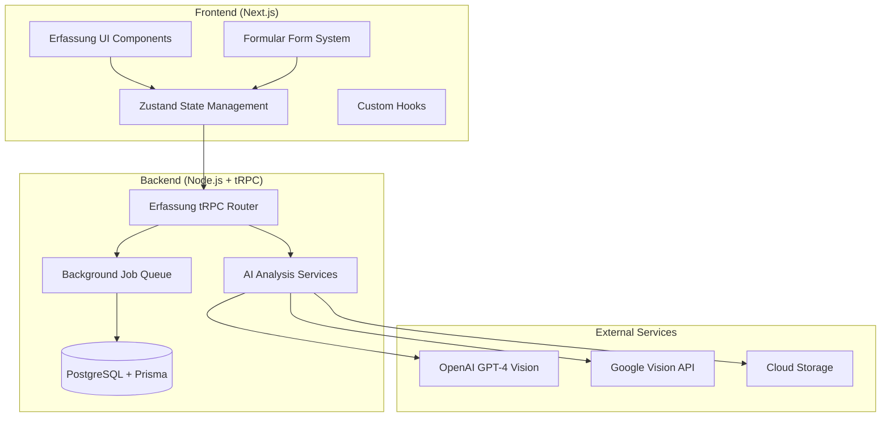

# Erfassung Technical Architecture

## Overview
This document outlines the technical architecture for integrating Erfassung (AI-powered product cataloging with structured data tables) into the existing Formular platform. The system creates tables from photos using advanced AI analysis and automates the complete workflow from photo capture to e-commerce platform integration, emphasizing code reuse, maintainability, and separation of concerns.

## System Architecture

### High-Level Architecture


### Integration Points with Existing Formular

#### 1. Navigation Integration
- **Location**: `frontend/src/app/components/TopNavigation.tsx`
- **Approach**: Add Erfassung to existing "Lösungen" dropdown
- **Implementation**: Minimal changes to existing navigation structure

#### 2. Database Integration  
- **Location**: `backend/prisma/schema.prisma`
- **Approach**: Extend existing schema with Erfassung-specific models
- **Implementation**: New models coexist with existing User/Organization models

#### 3. Authentication Integration
- **Approach**: Reuse existing NextAuth.js authentication system
- **Implementation**: Erfassung respects existing user sessions and permissions

#### 4. API Integration
- **Location**: `backend/trpc/`
- **Approach**: Add new Erfassung routers to existing tRPC setup
- **Implementation**: Follow existing router patterns and middleware

## Component Architecture Strategy

### Leveraging Existing Formular Technology for Table-Based Data Management

#### Form System Reuse for Structured Data Tables
Instead of creating custom product data entry forms, we'll leverage Formular's existing dynamic form system to create structured data tables with 21 standardized fields. Each product becomes a row in the table, with columns representing the standardized data fields:

```typescript
// Erfassung-specific form templates using Formular's form technology
export const productDataFormTemplate: FormTemplate = {
  id: 'product-data-review',
  name: 'Product Data Review',
  description: 'Review and edit AI-extracted product information',
  isMultiStep: true,
  steps: [
    {
      id: 'basic-info',
      title: 'Grundinformationen',
      description: 'Produktname, Hersteller und Beschreibung',
      fields: [
        {
          id: 'title',
          type: 'text',
          name: 'title',
          label: 'Produkttitel',
          required: true,
          placeholder: 'Samsung Galaxy Tab S8'
        },
        {
          id: 'manufacturer', 
          type: 'text',
          name: 'manufacturer',
          label: 'Hersteller',
          required: true,
          placeholder: 'Samsung'
        },
        {
          id: 'articleNumber',
          type: 'text', 
          name: 'articleNumber',
          label: 'Artikelnummer',
          placeholder: 'SM-X700NZAA'
        },
        {
          id: 'shortDescription',
          type: 'textarea',
          name: 'shortDescription', 
          label: 'Kurzbeschreibung',
          rows: 2,
          placeholder: 'Android Tablet mit 11" Display'
        },
        {
          id: 'longDescription',
          type: 'textarea',
          name: 'longDescription',
          label: 'Ausführliche Beschreibung', 
          rows: 4,
          placeholder: 'Hochwertiges Android-Tablet...'
        }
      ]
    },
    {
      id: 'dimensions',
      title: 'Abmessungen & Gewicht',
      description: 'Physische Eigenschaften des Produkts',
      fields: [
        {
          id: 'length',
          type: 'number',
          name: 'length',
          label: 'Länge (mm)',
          min: 0,
          placeholder: '253.8'
        },
        {
          id: 'width', 
          type: 'number',
          name: 'width',
          label: 'Breite (mm)',
          min: 0,
          placeholder: '165.3'
        },
        {
          id: 'height',
          type: 'number', 
          name: 'height',
          label: 'Höhe (mm)',
          min: 0,
          placeholder: '6.3'
        },
        {
          id: 'weight',
          type: 'number',
          name: 'weight', 
          label: 'Gewicht (g)',
          min: 0,
          placeholder: '503'
        }
      ]
    },
    {
      id: 'categories',
      title: 'Kategorisierung',
      description: 'Produktkategorien für ERP-Export',
      fields: [
        {
          id: 'mainCategoryA',
          type: 'select',
          name: 'mainCategoryA',
          label: 'Hauptkategorie A',
          options: [
            { label: 'Elektronik', value: 'elektronik' },
            { label: 'Möbel', value: 'moebel' },
            { label: 'Bekleidung', value: 'bekleidung' },
            { label: 'Bücher', value: 'buecher' }
          ]
        },
        {
          id: 'mainCategoryB',
          type: 'select', 
          name: 'mainCategoryB',
          label: 'Hauptkategorie B',
          conditionalLogic: {
            fieldId: 'mainCategoryA',
            condition: 'isEqualTo',
            value: 'elektronik'
          },
          options: [
            { label: 'Computer & Tablets', value: 'computer-tablets' },
            { label: 'Smartphones', value: 'smartphones' }, 
            { label: 'Audio & Video', value: 'audio-video' }
          ]
        }
      ]
    },
    {
      id: 'sales-data',
      title: 'Verkaufsdaten',
      description: 'Preis, Lagerbestand und Einheit',
      isOptional: true,
      fields: [
        {
          id: 'price',
          type: 'number',
          name: 'price',
          label: 'Preis (€)',
          min: 0,
          placeholder: '649.99'
        },
        {
          id: 'stockQuantity',
          type: 'number',
          name: 'stockQuantity', 
          label: 'Lagerbestand',
          min: 0,
          placeholder: '15'
        },
        {
          id: 'unit',
          type: 'select',
          name: 'unit',
          label: 'Einheit',
          defaultValue: 'stueck',
          options: [
            { label: 'Stück', value: 'stueck' },
            { label: 'Meter', value: 'meter' },
            { label: 'Kilogramm', value: 'kg' },
            { label: 'Liter', value: 'liter' }
          ]
        }
      ]
    }
  ]
};
```

#### State Management Integration for Table-Based Data
```typescript
// Extend existing form builder store for Erfassung table management
import { useFormBuilderStore } from '../hooks/useFormBuilderStore';

interface ErfassungTableState extends FormBuilderState {
  // Table-specific state
  productTable: ProductTableRow[];
  currentEditingRow: ProductTableRow | null;
  analysisResults: AnalysisResult | null;
  photos: ProductPhoto[];
  confidenceScores: ConfidenceScores;
  exportFormats: ExportFormat[];
  
  // E-commerce integration state
  integrationSettings: IntegrationSettings;
  syncStatus: SyncStatus;
  
  // Table-specific actions
  addProductRow: (product: ProductTableRow) => void;
  updateProductRow: (rowId: string, updates: Partial<ProductTableRow>) => void;
  deleteProductRow: (rowId: string) => void;
  setCurrentEditingRow: (row: ProductTableRow | null) => void;
  populateRowFromAnalysis: (results: AnalysisResult) => void;
  bulkUpdateRows: (rowIds: string[], updates: Partial<ProductTableRow>) => void;
  exportTable: (format: ExportFormat, rowIds?: string[]) => void;
  syncToEcommerce: (platform: EcommercePlatform, rowIds: string[]) => void;
  
  // Analysis actions
  setAnalysisResults: (results: AnalysisResult) => void;
  updateFieldConfidence: (fieldId: string, confidence: number) => void;
}

interface ProductTableRow {
  id: string;
  // Kivitendo-compatible fields
  title: string;
  manufacturer: string;
  articleNumber: string;
  shortDescription: string;
  longDescription: string;
  // ... 16 more standardized fields
  
  // Meta fields
  status: 'draft' | 'analyzed' | 'reviewed' | 'exported' | 'published';
  confidence: ConfidenceScores;
  photos: ProductPhoto[];
  lastModified: Date;
  syncStatus: Record<EcommercePlatform, SyncStatus>;
}

export const useErfassungTableStore = create<ErfassungTableState>((set, get) => ({
  // Inherit from form builder store
  ...useFormBuilderStore.getState(),
  
  // Table-specific state
  productTable: [],
  currentEditingRow: null,
  analysisResults: null,
  photos: [],
  confidenceScores: {},
  exportFormats: ['CSV', 'XLSX', 'JSON', 'XML', 'TSV'],
  integrationSettings: {},
  syncStatus: 'idle',

  // Table management actions
  addProductRow: (product) => set(state => ({
    productTable: [...state.productTable, product]
  })),
  
  updateProductRow: (rowId, updates) => set(state => ({
    productTable: state.productTable.map(row => 
      row.id === rowId ? { ...row, ...updates, lastModified: new Date() } : row
    )
  })),
  
  populateRowFromAnalysis: (results) => {
    const newRow: ProductTableRow = {
      id: `row-${Date.now()}`,
      // Map AI analysis results to table columns
      title: results.title || '',
      manufacturer: results.manufacturer || '',
      articleNumber: results.articleNumber || '',
      // ... map all 21 fields
      status: 'analyzed',
      confidence: results.confidence || {},
      photos: results.photos || [],
      lastModified: new Date(),
      syncStatus: {}
    };
    
    get().addProductRow(newRow);
  },
  
  exportTable: (format, rowIds) => {
    const rowsToExport = rowIds 
      ? get().productTable.filter(row => rowIds.includes(row.id))
      : get().productTable;
    
    // Trigger export job based on format
    // Implementation will handle CSV, XLSX, JSON, XML, TSV formats
  },
  
  syncToEcommerce: (platform, rowIds) => {
    const rowsToSync = get().productTable.filter(row => rowIds.includes(row.id));
    
    // Trigger sync job for Medusa JS, Shopware, or other platforms
    // Implementation will handle platform-specific API calls
  }
}));
```

#### Component Reuse Strategy
```typescript
// Enhanced FormField component with confidence indicators
import { FormField } from '../components/FormField';
import { ConfidenceIndicator } from './components/ConfidenceIndicator';

interface ErfassungFormFieldProps {
  field: FieldConfig;
  value: string;
  confidence?: number;
  onFieldChange: (e: React.ChangeEvent<HTMLInputElement>) => void;
  onManualEdit?: (fieldId: string) => void;
}

export function ErfassungFormField({
  field,
  value,
  confidence,
  onFieldChange,
  onManualEdit
}: ErfassungFormFieldProps) {
  return (
    <div className="space-y-2">
      <div className="flex items-center justify-between">
        <label className="text-sm font-medium text-gray-700 dark:text-gray-300">
          {field.label}
          {field.required && <span className="text-red-500">*</span>}
        </label>
        
        {confidence !== undefined && (
          <ConfidenceIndicator 
            score={confidence}
            onManualEdit={() => onManualEdit?.(field.id)}
          />
        )}
      </div>
      
      {/* Reuse existing FormField component */}
      <FormField
        field={field}
        value={value}
        onChange={onFieldChange}
        className={confidence && confidence < 0.6 ? 'border-yellow-400' : ''}
      />
    </div>
  );
}
```

## Directory Structure

### Frontend Structure
```
frontend/src/app/
├── erfassung/                          # Erfassung feature module
│   ├── page.tsx                        # Dashboard with table overview
│   ├── new/
│   │   └── page.tsx                    # New product workflow (Photo → Table)
│   ├── table/
│   │   ├── page.tsx                    # Main data table view
│   │   └── [id]/
│   │       ├── page.tsx                # Row details view
│   │       └── edit/page.tsx           # Edit table row
│   ├── exports/
│   │   ├── page.tsx                    # Export center with format options  
│   │   ├── history/page.tsx             # Export history and downloads
│   │   └── templates/page.tsx           # Export template management
│   ├── integrations/
│   │   ├── page.tsx                    # E-commerce platform settings
│   │   ├── medusa/page.tsx             # Medusa JS integration config
│   │   ├── shopware/page.tsx           # Shopware integration config
│   │   └── sync/page.tsx               # Sync status and automation
│   ├── settings/
│   │   └── page.tsx                    # Erfassung settings
│   ├── components/                     # Erfassung-specific components
│   │   ├── ErfassungWorkflow.tsx       # Main workflow component
│   │   ├── PhotoUploadStep.tsx         # Photo upload step
│   │   ├── AnalysisStep.tsx            # AI analysis step
│   │   ├── ReviewStep.tsx              # Data review step (populates table)
│   │   ├── ProductDataTable.tsx        # Main data table component
│   │   ├── TableRow.tsx                # Individual table row component
│   │   ├── TableFilters.tsx            # Filtering and search controls
│   │   ├── BulkActions.tsx             # Bulk operations toolbar
│   │   ├── ExportCenter.tsx            # Advanced export interface
│   │   ├── ExportFormatSelector.tsx    # Multi-format export selection
│   │   ├── IntegrationPanel.tsx        # E-commerce platform connections
│   │   ├── SyncStatusIndicator.tsx     # Platform sync status
│   │   ├── ProductCard.tsx             # Product display card
│   │   ├── PhotoGrid.tsx               # Photo gallery
│   │   ├── ConfidenceIndicator.tsx     # AI confidence display
│   │   └── ProductAnalysisStatus.tsx   # Analysis progress
│   ├── hooks/                          # Erfassung-specific hooks
│   │   ├── useErfassungTableStore.ts   # Extended table state management
│   │   ├── useProductAnalysis.ts       # AI analysis hook
│   │   ├── usePhotoUpload.ts           # Photo upload logic
│   │   ├── useAdvancedExport.ts        # Multi-format export functionality
│   │   ├── useEcommerceSync.ts         # Platform integration hooks
│   │   ├── useTableOperations.ts       # Table CRUD operations
│   │   ├── useBulkActions.ts           # Bulk table operations
│   │   └── useInventoryManagement.ts   # Inventory operations
│   ├── types/                          # Erfassung type definitions
│   │   ├── product.ts                  # Product data types
│   │   ├── table.ts                    # Table structure and row types
│   │   ├── analysis.ts                 # AI analysis types
│   │   ├── export.ts                   # Advanced export format types
│   │   ├── integration.ts              # E-commerce platform types
│   │   ├── sync.ts                     # Synchronization status types
│   │   └── workflow.ts                 # Workflow state types
│   └── utils/                          # Erfassung utilities
│       ├── productValidation.ts        # Product data validation
│       ├── tableValidation.ts          # Table structure validation
│       ├── exportFormatters.ts         # Multi-format export converters
│       ├── integrationUtils.ts         # E-commerce platform utilities
│       ├── photoUtils.ts               # Photo processing utilities
│       ├── confidenceCalculator.ts     # Confidence scoring
│       └── dataTransformers.ts         # Data format transformation utilities
└── components/                         # Shared components (existing)
    ├── FormField.tsx                   # Reused for product forms
    ├── ProgressIndicator.tsx           # Reused for workflow
    ├── Modal.tsx                       # Reused for dialogs
    └── Button.tsx                      # Reused throughout
```

### Backend Structure
```
backend/
├── trpc/
│   └── routers/
│       ├── erfassung/                  # Erfassung tRPC routers
│       │   ├── products.ts             # Product CRUD operations
│       │   ├── analysis.ts             # AI analysis endpoints
│       │   ├── photos.ts               # Photo upload/management
│       │   ├── exports.ts              # Export generation
│       │   └── inventory.ts            # Inventory operations
│       └── index.ts                    # Router registration
├── services/
│   ├── erfassung/                      # Erfassung business logic
│   │   ├── ProductAnalysisService.ts   # AI analysis orchestration
│   │   ├── PhotoStorageService.ts      # Photo storage management
│   │   ├── ExportService.ts            # Export generation
│   │   ├── InventoryService.ts         # Inventory management
│   │   └── ValidationService.ts        # Data validation
│   └── ai/                             # AI service integrations  
│       ├── OpenAIService.ts            # OpenAI GPT-4 Vision
│       ├── GoogleVisionService.ts      # Google Vision API
│       ├── TesseractService.ts         # Tesseract OCR fallback
│       └── AnalysisOrchestrator.ts     # AI service coordination
├── jobs/
│   ├── erfassung/                      # Erfassung background jobs
│   │   ├── productAnalysisJob.ts       # AI analysis processing
│   │   ├── photoProcessingJob.ts       # Photo optimization
│   │   ├── exportGenerationJob.ts      # Export file generation
│   │   └── inventorySyncJob.ts         # Inventory synchronization
│   └── processors.ts                   # Job processor registration
├── controllers/
│   └── erfassungController.ts          # HTTP endpoints (if needed)
├── middleware/
│   ├── erfassungAuth.ts                # Erfassung-specific auth
│   └── photoUpload.ts                  # Photo upload middleware
└── lib/
    ├── erfassung/                      # Erfassung utilities
    │   ├── exportFormatters.ts         # Export format generators
    │   ├── photoProcessor.ts           # Image processing
    │   └── confidenceCalculator.ts     # Confidence scoring
    └── storage/                        # Storage abstractions
        ├── PhotoStorage.ts             # Photo storage interface
        └── CloudStorageAdapter.ts      # Cloud storage implementation
```

## Key Design Principles

### 1. Separation of Concerns
- **UI Components**: Focus only on rendering and user interaction
- **Business Logic**: Centralized in service layer
- **State Management**: Predictable state updates via Zustand
- **Data Access**: Isolated in tRPC routers and Prisma

### 2. Code Reuse & DRY
- **Form System**: Reuse Formular's dynamic form technology for product data entry
- **UI Components**: Extend existing components rather than creating new ones
- **State Management**: Build upon existing form builder store patterns
- **Validation**: Reuse existing validation hooks and patterns

### 3. Maintainability
- **TypeScript**: Strong typing throughout the application
- **Clear Interfaces**: Well-defined contracts between layers
- **Consistent Patterns**: Follow existing Formular architectural patterns
- **Documentation**: Comprehensive inline and external documentation

### 4. Extensibility
- **Modular Architecture**: Easy to add new AI services or export formats
- **Plugin System**: Configurable analysis pipelines
- **Template System**: Customizable product data forms per industry
- **API Design**: RESTful and tRPC endpoints for external integrations

### 5. Performance
- **Lazy Loading**: Components and data loaded on demand
- **Background Processing**: AI analysis via job queues
- **Caching**: Strategic caching of analysis results and photos
- **Optimization**: Progressive image loading and data fetching

## Data Flow Architecture

### 1. Photo Upload Flow
```typescript
// Photo upload data flow
PhotoUploadComponent 
  → usePhotoUpload hook
  → PhotoStorageService 
  → Cloud Storage
  → Database (ProductPhoto model)
  → WebSocket notification to UI
```

### 2. AI Analysis Flow  
```typescript
// AI analysis data flow
AnalysisStep Component
  → useProductAnalysis hook
  → tRPC analysis.analyzeProduct
  → Background Job Queue
  → ProductAnalysisService
  → AI Services (OpenAI, Google Vision)
  → Database (ProductAnalysis model)
  → WebSocket notification to UI
  → Form auto-population
```

### 3. Data Review Flow
```typescript
// Product data review flow  
ReviewStep Component
  → useErfassungFormStore (extends useFormBuilderStore)
  → Formular's form system (FormField components)
  → Real-time validation
  → Confidence scoring
  → Manual override tracking
```

### 4. Export Flow
```typescript
// Export generation flow
ExportStep Component
  → useProductExport hook
  → tRPC exports.generateExport  
  → Background Job Queue
  → ExportService
  → Format-specific generators (CSV, JSON, XML)
  → File storage
  → Download link generation
```

## Security Considerations

### 1. Authentication & Authorization
- **User Context**: All operations respect existing user sessions
- **Organization Isolation**: Products scoped to user organizations
- **Role-Based Access**: Admin/user permissions for different operations
- **API Security**: tRPC middleware for authentication checks

### 2. Data Privacy
- **Photo Storage**: Secure cloud storage with access controls
- **Analysis Data**: Encryption at rest for sensitive product information
- **User Data**: GDPR compliance for EU users
- **Audit Logging**: Track all data access and modifications

### 3. Input Validation
- **Photo Validation**: File type, size, and content validation
- **Data Sanitization**: Prevent XSS and injection attacks
- **Rate Limiting**: Prevent abuse of AI analysis endpoints
- **Business Logic Validation**: Ensure data integrity

## Testing Strategy

### 1. Unit Tests
- **Service Layer**: Test business logic in isolation
- **Utility Functions**: Test data transformations and calculations
- **Hooks**: Test state management and side effects
- **Components**: Test rendering and user interactions

### 2. Integration Tests
- **API Endpoints**: Test tRPC router functionality
- **Database Operations**: Test Prisma model interactions
- **AI Service Integration**: Test external API calls with mocks
- **File Upload**: Test photo storage and processing

### 3. End-to-End Tests
- **Complete Workflows**: Test full product cataloging flow
- **Cross-Browser**: Ensure compatibility across browsers
- **Mobile Responsiveness**: Test mobile photo capture workflow
- **Performance**: Test with realistic data volumes

## Deployment Considerations

### 1. Environment Configuration
- **Development**: Local AI service mocks for rapid development
- **Staging**: Full AI integration with test data
- **Production**: Optimized for performance and reliability

### 2. Scalability
- **Horizontal Scaling**: Stateless services for easy scaling
- **Background Jobs**: Queue scaling for AI processing
- **Database Performance**: Optimized queries and indexing
- **CDN Integration**: Photo delivery optimization

### 3. Monitoring
- **Application Metrics**: Performance and error monitoring
- **AI Service Health**: Track external API availability
- **User Analytics**: Usage patterns and feature adoption
- **Cost Monitoring**: Track AI service usage and costs

## Migration Strategy

### Phase 1: Foundation (Week 1-2)
1. Database schema migration
2. Basic UI navigation integration
3. Photo upload functionality
4. Core tRPC routers

### Phase 2: AI Integration (Week 3-4)  
1. OpenAI GPT-4 Vision integration
2. Background job processing
3. Basic product analysis workflow
4. Form integration for data review

### Phase 3: Polish & Optimization (Week 5-6)
1. Advanced AI features (Google Vision, Tesseract)
2. Export functionality
3. Inventory management
4. Performance optimization

This architecture ensures Erfassung integrates seamlessly with existing Formular systems while maintaining clean separation of concerns and providing a solid foundation for future enhancements.